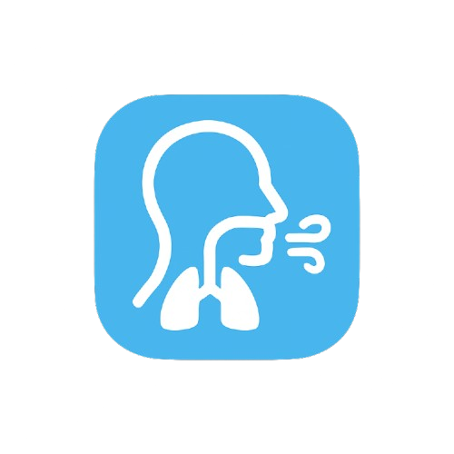

# BreathState

**An open-source Android/iOS and PC app for breathing and heart-rate synchronization**



---

## Overview

BreathState is a cross-platform mobile and desktop app designed to measure and analyze heart rate and breathing rate simultaneously. By connecting to a heart rate sensor (Polar H10) and using the device microphone, the app provides biofeedback metrics such as Heart Rate Variability (HRV) and Resonance Frequency Breathing.  

It is **open-source**, making advanced biofeedback tools accessible for researchers, healthcare professionals, and individuals. The app provides guided breathing exercises and allows exporting recorded data for further analysis.

---

## Features

- Measure breathing rate using inbuilt or external microphone  
- Measure heart rate using a Polar H10 sensor  
- Find individual **resonance frequency** to optimize HRV  
- Guided breathing exercises:
  - Box Breathing  
  - Equal Breathing  
  - 4-7-8 Breathing  
  - Resonance Breathing  
- Local storage of heart and breathing rate  
- Export recorded data for further analysis  


---

## How to Contribute

We welcome contributions from the community! Here’s how you can help:

1. **Fork the repository** and create a new branch for your feature/fix:
    ```bash
    git checkout -b feature/your-feature-name
    ```

2. **Make your changes** and test thoroughly.  

3. **Commit your changes** with descriptive messages:
    ```bash
    git commit -m "Add feature XYZ"
    ```

4. **Push your branch** to your fork:
    ```bash
    git push origin feature/your-feature-name
    ```

5. **Open a Pull Request** against the `main` branch of this repository.  

**Contribution Guidelines:**
- Follow existing coding style and formatting  
- Add comments for major logic blocks  
- Ensure the app builds successfully on both Android and iOS  

## GSoC 2025 Final Report

For a detailed overview of the project, please refer to the [GSoC 2025 Final Report](https://gist.github.com/michaelLewis04/126e29b5450704977f8c45c1d443813b)